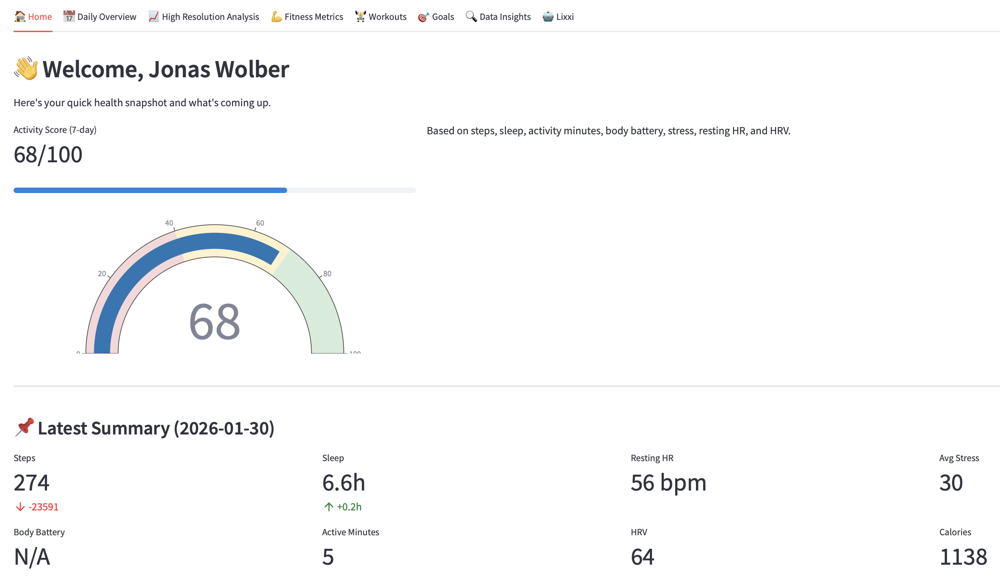
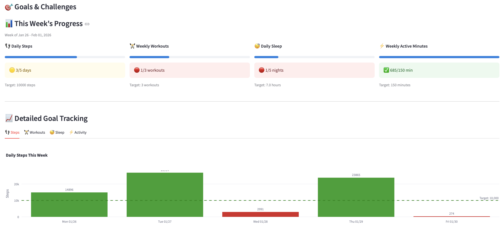
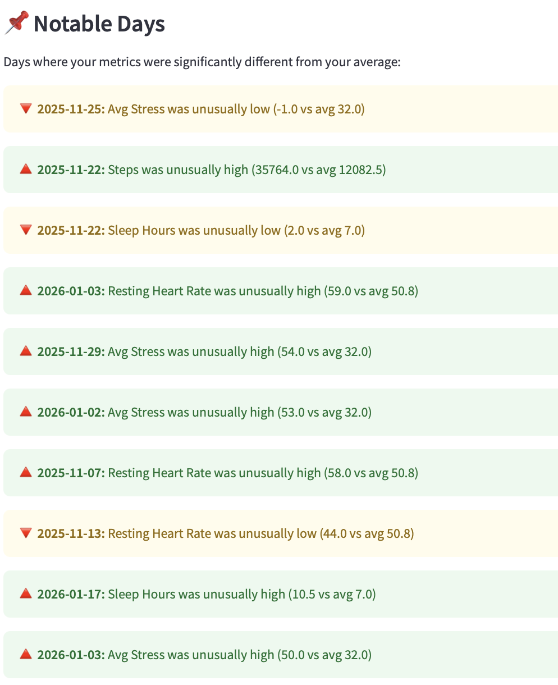
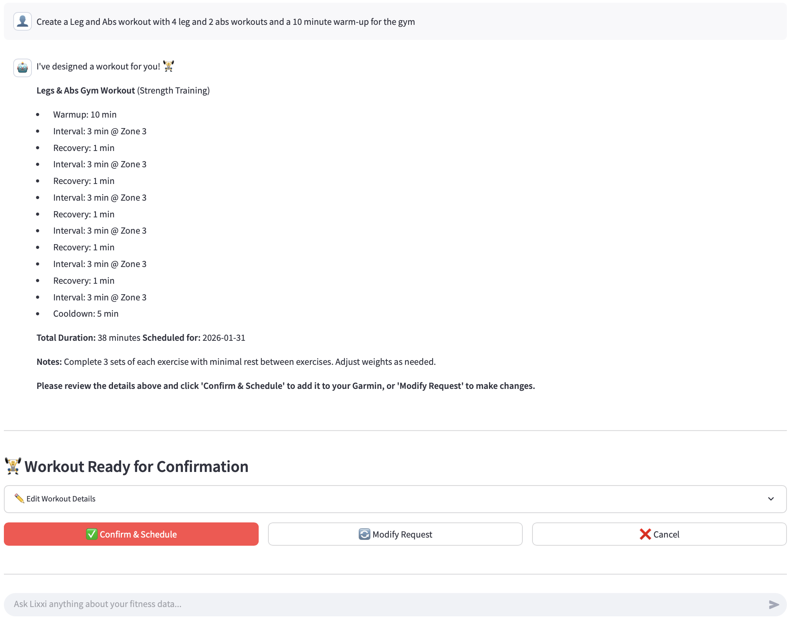

# Garmin Data Dashboard

A comprehensive Python application for collecting, storing, and visualizing your Garmin fitness data locally. Features an interactive Streamlit dashboard with password protection, AI-powered workout creation, goal tracking, and detailed analytics.

## Screenshots

| Home Dashboard | Goals & Challenges |
|:-:|:-:|
|  |  |

| Data Insights | Workouts |
|:-:|:-:|
|  |  |

## Features

### Core Features
- 📊 **Local Data Storage**: All data stored in CSV files (no cloud dependencies)
- 📈 **Interactive Dashboard**: Beautiful Streamlit dashboard with 8 different views
- 🔐 **Password Protection**: Secure access to your personal health data
- 🔄 **Auto-Sync**: Dashboard automatically checks for and fetches new data on startup

### Health & Fitness Tracking
- 📉 **Daily Metrics**: Track steps, sleep, heart rate, stress, body battery, HRV, and more
- ⏱️ **High-Resolution Data**: Time-series analysis at 2-3 minute intervals for heart rate, stress, body battery, respiration, and SpO2
- 💪 **Fitness Metrics**: VO2 Max, Training Status, Training Load, Lactate Threshold, Fitness Age

### Workout Management
- 🏋️ **Workout Creation**: Create workouts with simple, interval, or custom structures
- 📅 **Week View Calendar**: Visual calendar with completed and scheduled workouts
- 🔗 **Garmin Sync**: Workouts automatically sync to your Garmin watch

### Goals & Insights
- 🎯 **Goals & Challenges**: Set and track daily/weekly fitness goals with progress visualization
- 🔍 **Data Insights**: Advanced correlation analysis, recovery scoring, and trend detection
- 📊 **Weekly Patterns**: Identify your best/worst days for each metric

### AI Assistant
- 🤖 **Lixxi AI Chatbot**: Mistral-powered fitness assistant with access to your Garmin data
- 🔧 **Function Calling**: Let Lixxi create and schedule workouts for you via natural language
- 💬 **Chat History**: All conversations saved locally with full history management

## Quick Start

```bash
# 1. Clone and enter directory
cd Garmin

# 2. Install dependencies
pip install -r requirements.txt

# 3. Create .env file with your credentials
echo "GARMIN_EMAIL=your_email@example.com" > .env
echo "GARMIN_PASSWORD=your_password" >> .env
echo "DASHBOARD_PASSWORD=your_secret_password" >> .env

# 4. Collect your Garmin data (last 30 days)
python3 collect_garmin_data.py

# 5. Launch the dashboard
streamlit run streamlit_dashboard.py
```

The dashboard will open at `http://localhost:8501`. Enter your `DASHBOARD_PASSWORD` to access.

## Setup

### 1. Install Dependencies

```bash
pip install -r requirements.txt
```

### 2. Configure Environment Variables

Create a `.env` file in the project root:

```env
# Required - Garmin Connect credentials
GARMIN_EMAIL=your_email@example.com
GARMIN_PASSWORD=your_password
DASHBOARD_PASSWORD=your_dashboard_password

# Optional - AI Chatbot (Lixxi)
CHATBOT_NAME=Lixxi
MISTRAL_AI_API_KEY=your_mistral_api_key
MISTRAL_MODEL=ministral-14b-2512
```

**Required:**
- `GARMIN_EMAIL`: Your Garmin Connect email
- `GARMIN_PASSWORD`: Your Garmin Connect password
- `DASHBOARD_PASSWORD`: Password to access the Streamlit dashboard

**Optional (for AI Chatbot):**
- `CHATBOT_NAME`: Name for your AI assistant (default: "Lixxi")
- `MISTRAL_AI_API_KEY`: Your Mistral AI API key ([Get one here](https://console.mistral.ai/))
- `MISTRAL_MODEL`: Mistral model to use (default: "ministral-14b-2512")

## Data Collection

### Collect Garmin Data

The `collect_garmin_data.py` script fetches all available Garmin data and stores it locally in CSV files.

**Usage:**
```bash
# Collect last 30 days (default)
python3 collect_garmin_data.py

# Collect last 7 days
python3 collect_garmin_data.py 7

# Collect last 90 days
python3 collect_garmin_data.py 90
```

**What it collects:**
- ✅ **Daily Summary Data**: Steps, distance, calories, heart rate, sleep, stress, body battery, HRV, SpO2, respiration, hydration
- ✅ **Time-Series Data**: High-resolution (2-3 minute intervals) for:
  - Heart Rate
  - Stress Levels
  - Body Battery
  - Respiration Rate
  - SpO2 (Blood Oxygen)
- ✅ **Workouts**: All completed activities with detailed metrics

**Data Storage:**
```
data/
├── daily/
│   └── daily_summary.csv          # Aggregated daily metrics
├── time_series/
│   ├── heart_rate.csv             # Heart rate time-series
│   ├── stress.csv                 # Stress level time-series
│   ├── body_battery.csv           # Body battery time-series
│   ├── respiration.csv            # Respiration rate time-series
│   └── spo2.csv                   # SpO2 time-series
└── workouts/
    └── workouts.csv               # Completed workouts
```

**Features:**
- Idempotent: Skips dates that already have data
- Always fetches workouts (even if daily data is up to date)
- Handles missing data gracefully
- Progress indicators and error reporting

## Interactive Dashboard

### Launch Dashboard

```bash
streamlit run streamlit_dashboard.py
```

The dashboard will open in your browser at `http://localhost:8501`

### Dashboard Features

#### 🔐 Password Protection
- Enter the password from `DASHBOARD_PASSWORD` in `.env` to access
- Session-based authentication
- Logout button in sidebar

#### 🏠 Home Tab
- **Welcome Screen**: Personalized greeting with user name from Garmin
- **Activity Score**: 0-100 score based on last 7 days of activity
- **Today's Summary**: Steps, sleep, stress, body battery at a glance
- **Scheduled Workouts**: Upcoming workouts for the week
- **Quick Stats**: Key metrics with visual indicators

#### 📅 Daily Overview Tab
- **Configurable Metrics**: Select which daily metrics to display
- **Default Metrics**: Steps, Resting Heart Rate, Sleep Hours, Body Battery Max, Average Stress
- **Date Range Filter**: View data for any date range
- **Interactive Charts**: Plotly visualizations with hover details
- **2-Column Layout**: Clean, organized display

#### 📈 High Resolution Analysis Tab
- **Intraday Metrics**: View detailed time-series data for a specific date
- **Selectable Metrics**: Choose from Heart Rate, Stress, Body Battery, Respiration, SpO2, HRV During Sleep
- **Date Picker**: Select any date with available data
- **Multiple Metrics**: Overlay multiple metrics for comparison

#### 💪 Fitness Metrics Tab
- **VO2 Max**: Current value and trend over time
- **Fitness Age**: Calculated fitness age vs chronological age
- **Training Status**: Productive, Maintaining, Detraining, etc.
- **Training Load Balance**: Aerobic low/high and anaerobic loads
- **Lactate Threshold**: Speed and heart rate at threshold
- **HRV Summary**: Weekly average, baseline, and status

#### 🏋️ Workouts Tab
- **Week View Calendar**: 
  - Navigate between weeks
  - See completed workouts on each day
  - Current day highlighted
  - Quick overview with emoji indicators
  
- **Create & Schedule Workouts**:
  - Create new workouts (Strength, Running, Cycling, Walking, Yoga, HIIT)
  - Set duration and schedule date
  - One-click creation and scheduling to Garmin Connect
  - Syncs to your Garmin watch automatically
  
- **Saved Workouts**:
  - View your saved workout templates
  - Quick schedule any template to a specific date
  
- **Completed Workouts**:
  - Detailed list of completed workouts for the week
  - Summary statistics (total time, calories, distance)
  - Expandable cards with full workout details
  - Metrics: Duration, Distance, Calories, Heart Rate, Elevation, Steps, Training Effect, VO2 Max

#### 🎯 Goals & Challenges Tab
- **Weekly Goal Progress**:
  - 👣 Daily Steps Goal (default: 10,000 steps)
  - 🏋️ Weekly Workouts Goal (default: 3 workouts)
  - 😴 Daily Sleep Goal (default: 7 hours)
  - ⚡ Weekly Active Minutes Goal (default: 150 minutes)
  - Visual progress bars with color-coded status
  - Real-time tracking against targets

- **Detailed Goal Tracking**:
  - Interactive bar charts showing daily progress
  - Statistics: days achieved, weekly average, totals
  - Color-coded bars (green = achieved, orange = close, red = missed)
  - Target lines for visual reference

- **Challenges**:
  - Create custom weekly or monthly challenges
  - Challenge types: Total Steps, Workout Count, Average Sleep, Step Streak
  - Track progress with percentage completion
  - Challenge history with achieved/not achieved status
  - Remove completed challenges

- **Customizable Targets**:
  - Enable/disable individual goals
  - Set personalized target values
  - Persistent storage of settings

#### 🔍 Data Insights Tab
- **Recovery Score**: 0-100 gauge based on sleep, HRV, body battery, and stress
- **Key Trends**: Compare last 30 days vs previous 30 days
- **Correlation Analysis**: Discover relationships between health metrics
- **Weekly Patterns**: Identify best/worst days for each metric
- **Notable Days**: Outlier detection for unusual metric values
- **Interactive Heatmap**: Visual correlation matrix

#### 🤖 Lixxi AI Chatbot Tab
- **AI Fitness Assistant**: Powered by Mistral AI with access to your Garmin data
- **Personalized Advice**: Get workout suggestions, sleep analysis, and health tips
- **Chat History**: 
  - All conversations saved locally
  - Browse and continue previous chats
  - Delete unwanted conversations
- **Context-Aware**: Lixxi knows your recent activity, workouts, sleep, stress, and more
- **Suggested Prompts**: Quick-start questions to explore your fitness data

- **🔧 Function Calling (Workout Creation)**:
  - Enable "Allow Function Calling" toggle to let Lixxi create workouts
  - Ask Lixxi to create any type of workout:
    - Simple time-based workouts
    - Interval training with warmup/cooldown
    - Custom multi-step workouts
  - **Preview & Edit**: Review workout details before confirming
  - **Confirmation Required**: Workouts only created after you approve
  - Supports all Garmin workout options:
    - Sport types: Running, Cycling, Swimming, Strength, Walking, Hiking, Yoga
    - Step types: Warmup, Interval, Recovery, Cooldown, Rest
    - Heart rate zone targets (Zones 1-5)
    - Repeat groups for intervals
  - Example prompts:
    - "Create a 30-minute easy run for today"
    - "Build me a 4x4 minute interval workout with 2 min recovery"
    - "Schedule a strength training session for tomorrow"

- **Configuration**: Set in `.env`:
  ```env
  CHATBOT_NAME=Lixxi
  MISTRAL_AI_API_KEY=your_api_key
  MISTRAL_MODEL=ministral-14b-2512
  ```

## Scripts Overview

### `collect_garmin_data.py`
Main data collection script. Fetches and stores all Garmin data locally.

### `streamlit_dashboard.py`
Interactive web dashboard for viewing and managing your Garmin data.

### `analyze_garmin_data.py`
Static analysis script (optional). Generates visualizations and reports.

### `auto_sync_garmin.py`
Legacy script for syncing to Notion (deprecated - we now use local storage).

## Automation

### Weekly Data Collection (macOS/Linux)

Add to crontab to automatically collect data:

```bash
# Edit crontab
crontab -e

# Add this line to run every Sunday at 9 AM
0 9 * * 0 cd /path/to/Garmin && /usr/bin/python3 collect_garmin_data.py 7
```

### Manual Collection

Run whenever you want to update your data:

```bash
python3 collect_garmin_data.py
```

## Data Privacy & Security

- ✅ **Local Storage**: All data stored locally in CSV files
- ✅ **Password Protection**: Dashboard requires password authentication
- ✅ **No Cloud Dependencies**: Everything runs on your machine
- ✅ **Garmin Authentication**: Uses official Garmin Connect API (via garminconnect library)
- ✅ **Token Storage**: Garmin tokens stored securely in `~/.garminconnect`

## Troubleshooting

### "Could not connect to Garmin"
- Verify `GARMIN_EMAIL` and `GARMIN_PASSWORD` in `.env`
- Check your internet connection
- Garmin may require re-authentication (tokens expire after ~1 year)

### "No data found" in dashboard
- Run `python3 collect_garmin_data.py` first to collect data
- Check that CSV files exist in `data/` directory

### "Incorrect password" for dashboard
- Verify `DASHBOARD_PASSWORD` is set correctly in `.env`
- Password is case-sensitive

### Workout scheduling fails
- Ensure you're connected to Garmin (check credentials in `.env`)
- Verify the workout was created successfully
- Sync your Garmin watch to see scheduled workouts

### Missing time-series data
- Some dates may not have complete data (device not worn, etc.)
- The script handles missing data gracefully
- Check Garmin Connect app to verify data availability

## Project Structure

```
Garmin/
├── .env                          # Environment variables (not in git)
├── .gitignore                    # Git ignore rules
├── requirements.txt              # Python dependencies
├── README.md                     # This file
│
├── collect_garmin_data.py        # Main data collection script
├── streamlit_dashboard.py        # Interactive dashboard (3600+ lines)
├── analyze_garmin_data.py        # Static analysis & insights generation
│
├── example_images/               # Screenshot examples
│   ├── home.png                  # Home dashboard screenshot
│   ├── goals.png                 # Goals & Challenges screenshot
│   ├── insights.png              # Data Insights screenshot
│   └── workout.png               # Workouts tab screenshot
│
├── data/                         # Local data storage (not in git)
│   ├── daily/
│   │   └── daily_summary.csv     # Aggregated daily metrics
│   ├── time_series/
│   │   ├── heart_rate.csv        # Heart rate time-series
│   │   ├── stress.csv            # Stress level time-series
│   │   ├── body_battery.csv      # Body battery time-series
│   │   └── respiration.csv       # Respiration rate time-series
│   ├── workouts/
│   │   ├── workouts.csv          # Completed workouts
│   │   └── scheduled_workouts.csv # Scheduled workouts
│   ├── chats/                    # AI chatbot conversation history
│   │   └── *.json                # Individual chat files
│   └── goals.json                # User goals & challenges config
│
└── reports/                      # Generated reports (not in git)
    ├── visualizations/           # PNG chart exports
    ├── insights.json             # Computed insights for dashboard
    └── dashboard.html            # Static HTML dashboard
```

## Dependencies

- `garminconnect`: Garmin Connect API wrapper
- `streamlit`: Web dashboard framework
- `pandas`: Data manipulation
- `plotly`: Interactive visualizations
- `python-dotenv`: Environment variable management
- `numpy`: Numerical operations
- `requests`: HTTP client for Mistral AI API
- `matplotlib` & `seaborn`: Static visualization (for analysis script)

## Notes

- Garmin authentication tokens are stored in `~/.garminconnect` and are valid for one year
- The dashboard caches data for performance (use browser refresh to clear cache)
- Workout scheduling requires an active Garmin Connect account
- Some metrics may not be available for all dates depending on device usage
- Data collection respects Garmin API rate limits

## License

This project is for personal use. Garmin Connect API usage is subject to Garmin's Terms of Service.
